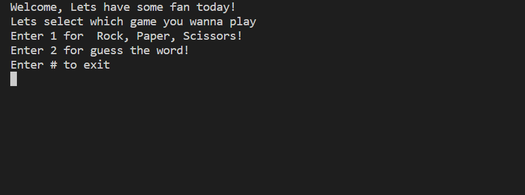
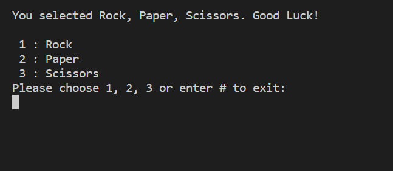
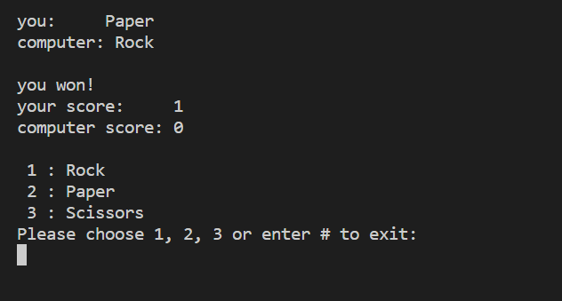
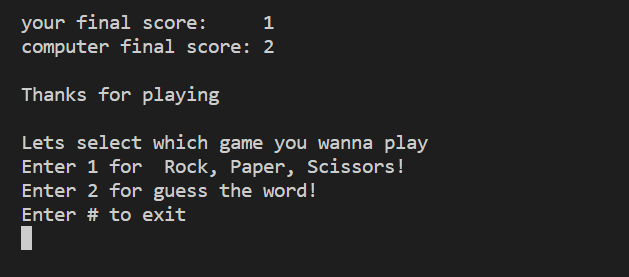
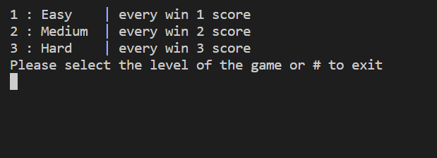
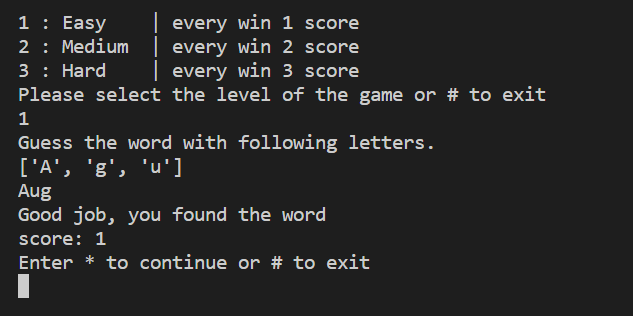

# Fun Time
Fun Time is a Python based game designed for a command line interface (CLI).It has two games; the first is Rock, Paper, Scissors and the second is Guess the Word. The gamer would compete against the computer in the first game. In the second game, the computer will give the player a list of letters, and the player must use all of the letters to guess the word. This game has three levels of difficulty. Fun Time launched in August 2022.

## Features 

- __Introduction__  
    - This is the first page the player will see.
    - It includes a welcome message and gives the user two game selection options.

- __Exceptions handled__  
    - Every input has validated and the game is error free

- __tidy and uncluttered__  
    - The terminal will be cleared in every stage 
    - There are instructions for each stage in the stage.

- __Easy to use__  
    - The instructions are available
    - The player has the opportunity to end the game at any point.

### Rock, Paper & Scissors
- The sole need for this easy game is luck.
- The Player is asked to choose one option between rock, paper and scissors
- The computer will also randomly choose one choice, and the results will update the player's and computer's scores.
- The screen will be cleared and the player and computer scores displayed after each round.
- Rounds are sequential.

### Guess The Word
- Three level of difficulty are available, the player will choose one in every round.
- The player must find the word using all the letters once the computer shows them some letters based on the level they have chosen.
- If the player correctly guesses the word, he will receive a score. If not, the computer will display the correct word.

## Testing

- __Manual Tecting__

Every step af the game is tested manually and carefully.
    

## Deployment

- The Game is developed using [Python essentials template](https://github.com/Code-Institute-Org/python-essentials-template) and deployed in [Heroku](https://www.heroku.com/) using the following steps:

    - Sign up and sign in to Heroku account
    - Click on "Create a New app" and give it a name
    - Select your region and then click 'Create app'
    - Go to the 'Settings' tab and click 'Reveal config vars'
    - Add new config var by adding 'PORT' and '8000' in 'KEY', 'VALUE' part
    - Click 'Add buildpack' and choose 'Python' and save
    - Then do the same with 'Nodejs'
    - Go to the 'Deploy' tab and select github
    - Connect your github account and select the repository
    - From 'Automatic Deploys' choose to setup automatic deploys so that everytime code pushed to github, Heroku will rebuild the app
    - Click 'Deploy Branch'
    - A link to launched application will be supplied once Heroku has completed developing it.

The live link can be found here - https://fun-time1.herokuapp.com/

## Credits
- [Code Institute course material](https://codeinstitute.net/)
- To get random english word: [RandomWords](https://pypi.org/project/RandomWords/)
- To clrear the terminal, choose random: os and random libraries 
- For deployment: [Heroku](https://www.heroku.com/)
